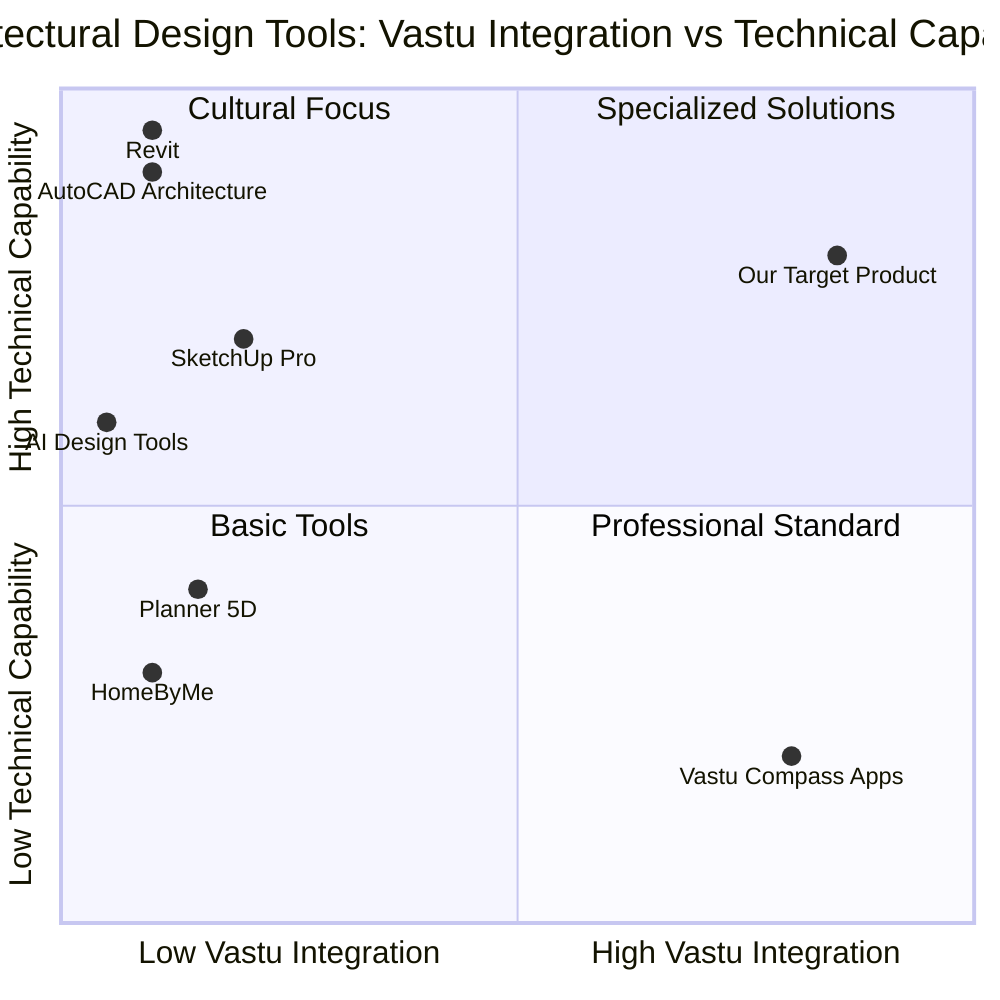

# PRD: LLM-Powered Vastu-Aware Architectural Design System

## 1. Language & Project Information

**Language:** English  
**Programming Language:** TypeScript, React, Shadcn-ui, Tailwind CSS  
**Project Name:** vastu_architect_ai  
**Original Requirements:** Building an LLM-powered Architect that is Vastu-aware and can design comprehensive architectural solutions including floor plans, buildings, interior spaces, and exterior environments with integrated landscape design.

## 2. Product Definition

### 2.1 Product Goals

1. **Holistic Vastu-Compliant Design**: Create an AI system that automatically generates comprehensive architectural solutions including interior layouts, furniture placement, exterior facades, and landscape designs - all adhering to Vastu Shastra principles while maintaining modern aesthetics and functionality.

2. **Integrated Interior-Exterior Generation**: Develop a comprehensive LLM-powered platform that seamlessly generates detailed floor plans, interior design schemes, exterior building models, landscape layouts, and complete architectural documentation based on natural language descriptions.

3. **Professional Multi-Domain Output**: Deliver industry-standard architectural drawings, interior design specifications, landscape plans, and construction documentation that can be directly used by architects, interior designers, landscape architects, and construction teams for real-world implementation.

### 2.2 User Stories

**As a homeowner**, I want to describe my dream house in natural language and receive complete Vastu-compliant designs including floor plans, interior layouts, furniture placement, color schemes, and landscape design, so that I can build and furnish a holistic home environment that aligns with traditional principles.

**As an architect**, I want to quickly generate comprehensive design concepts that incorporate Vastu guidelines for both building structure and site planning, so that I can deliver complete architectural solutions and focus on client refinement rather than initial concept development.

**As an interior designer**, I want to receive Vastu-compliant room layouts with furniture placement suggestions, color recommendations, lighting design, and material specifications, so that I can create harmonious living spaces that respect traditional guidelines while meeting modern aesthetic requirements.

**As a landscape architect**, I want to generate Vastu-aware outdoor designs including garden layouts, entrance positioning, water features, and plant selections, so that I can create exterior environments that complement the building's energy flow and traditional principles.

**As a real estate developer**, I want to create multiple Vastu-compliant building and landscape packages for different plot sizes, so that I can offer complete lifestyle solutions that appeal to culturally conscious buyers.

**As a homeowner planning renovation**, I want to redesign specific interior spaces or outdoor areas with Vastu guidance, so that I can improve my existing home's energy flow and aesthetic appeal without major structural changes.

**As a construction contractor**, I want to access detailed architectural, interior, and landscape drawings with integrated Vastu annotations, so that I can ensure proper implementation of traditional principles across all project phases.

### 2.3 Competitive Analysis

#### Direct Competitors:

1. **AutoCAD Architecture**
   - *Pros*: Industry standard, comprehensive tools, extensive library
   - *Cons*: No Vastu integration, steep learning curve, expensive licensing

2. **SketchUp Pro**
   - *Pros*: User-friendly, 3D modeling, plugin ecosystem
   - *Cons*: Limited Vastu features, requires manual compliance checking

3. **Revit**
   - *Pros*: BIM capabilities, collaboration features, parametric design
   - *Cons*: No cultural design principles, complex interface, high cost

4. **Planner 5D**
   - *Pros*: Easy to use, web-based, good visualization
   - *Cons*: Limited professional features, no Vastu awareness

5. **HomeByMe**
   - *Pros*: Consumer-friendly, real-time 3D, furniture library
   - *Cons*: Basic functionality, no traditional design principles

#### Indirect Competitors:

6. **Vastu Compass Apps**
   - *Pros*: Vastu-focused, mobile accessibility
   - *Cons*: Limited design capabilities, no architectural output

7. **AI Design Tools (Midjourney, DALL-E for architecture)**
   - *Pros*: Creative AI generation, visual inspiration
   - *Cons*: No technical accuracy, no Vastu knowledge, not construction-ready

### 2.4 Competitive Quadrant Chart

## 3. Technical Specifications

### 3.1 Requirements Analysis

The LLM-powered Vastu-aware architectural design system requires integration of multiple complex technologies:

**Core AI Components:**
- Large Language Model for natural language processing and design interpretation
- Computer vision for spatial analysis and layout optimization
- Generative AI for creating architectural drawings and 3D models
- Knowledge graph integration for Vastu Shastra principles and modern building codes

**Architectural Design Engine:**
- 2D floor plan generation with precise measurements
- 3D building model creation and visualization
- Structural analysis and feasibility checking
- Material specification and cost estimation

**Vastu Integration System:**
- Comprehensive Vastu Shastra rule engine
- Directional analysis and orientation optimization
- Room placement and size recommendations
- Energy flow visualization and optimization

**User Interface Requirements:**
- Intuitive natural language input interface
- Real-time design preview and modification
- Interactive 3D visualization with VR/AR support
- Professional drawing export capabilities

### 3.2 Requirements Pool

#### P0 (Must-Have) Requirements:
- **REQ-001**: Natural language input processing for architectural requirements
- **REQ-002**: Automated 2D floor plan generation with accurate dimensions
- **REQ-003**: Vastu Shastra compliance checking and recommendations
- **REQ-004**: Basic 3D model visualization of generated designs
- **REQ-005**: Export functionality for standard architectural file formats (DWG, PDF)
- **REQ-006**: Room layout optimization based on Vastu principles
- **REQ-007**: User authentication and project management system
- **REQ-008**: Responsive web interface supporting desktop and tablet devices

#### P1 (Should-Have) Requirements:
- **REQ-009**: Advanced 3D rendering with materials and lighting
- **REQ-010**: Integration with building codes and local regulations
- **REQ-011**: Cost estimation and material quantity calculations
- **REQ-012**: Collaborative features for sharing and commenting on designs
- **REQ-013**: Template library for common building types
- **REQ-014**: Vastu score calculation and improvement suggestions
- **REQ-015**: Integration with CAD software for professional workflows
- **REQ-016**: Mobile app for on-site design reviews

#### P2 (Nice-to-Have) Requirements:
- **REQ-017**: VR/AR visualization for immersive design experience
- **REQ-018**: AI-powered interior design suggestions
- **REQ-019**: Structural engineering analysis and recommendations
- **REQ-020**: Integration with construction management platforms
- **REQ-021**: Landscape design integration with Vastu principles
- **REQ-022**: Multi-language support for regional markets
- **REQ-023**: API for third-party integrations
- **REQ-024**: Advanced analytics and design pattern learning

### 3.3 UI Design Draft

#### Main Dashboard:
- **Header**: Logo, user profile, project navigation, help center
- **Sidebar**: Project list, recent designs, templates, Vastu guidelines
- **Main Canvas**: 
  - Natural language input box with voice recognition
  - Split-screen view: 2D floor plan (left) and 3D model (right)
  - Vastu compliance indicator panel
  - Design modification tools and property panels

#### Design Generation Workflow:
1. **Input Phase**: Natural language description box with examples and prompts
2. **Processing Phase**: Loading screen with AI progress indicators
3. **Review Phase**: Generated design with Vastu compliance score
4. **Refinement Phase**: Interactive editing tools with real-time Vastu feedback
5. **Export Phase**: Format selection and professional drawing generation

#### Key UI Components:
- **Vastu Compass**: Interactive directional guide for room placement
- **Property Panel**: Room dimensions, materials, Vastu compliance status
- **Layer Management**: Structural, electrical, plumbing, and Vastu overlay controls
- **Export Wizard**: Step-by-step guide for generating professional drawings

### 3.4 Open Questions

1. **LLM Selection and Training**: Which base LLM should be used, and what specific architectural and Vastu training data is required for optimal performance?

2. **Vastu Rule Complexity**: How should the system handle conflicting Vastu principles or situations where perfect compliance is impossible due to plot constraints?

3. **Regional Variations**: Should the system account for different regional interpretations of Vastu Shastra, and how should these variations be implemented?

4. **Professional Validation**: What level of professional architect review and approval should be integrated into the system for construction-ready outputs?

5. **Scalability Architecture**: How should the system handle complex multi-story buildings and large-scale architectural projects?

6. **Integration Standards**: Which industry-standard file formats and APIs should be prioritized for seamless integration with existing architectural workflows?

7. **Compliance Verification**: How should the system verify and update its knowledge of local building codes and regulations across different jurisdictions?

8. **Performance Optimization**: What are the acceptable response times for design generation, and how should the system balance quality with speed?

## 4. Success Metrics

### 4.1 User Engagement Metrics:
- Daily active users and design generation frequency
- Time spent in design refinement and iteration cycles
- User retention rate and project completion statistics

### 4.2 Quality Metrics:
- Vastu compliance accuracy rate (target: >95%)
- Professional architect approval rate for generated designs
- User satisfaction scores for design quality and usability

### 4.3 Business Metrics:
- Conversion rate from free to premium subscriptions
- Revenue per user and customer lifetime value
- Market penetration in target architectural and construction segments

## 5. Implementation Roadmap

### Phase 1 (MVP - 3 months):
- Core LLM integration and natural language processing
- Basic 2D floor plan generation
- Fundamental Vastu rule implementation
- Simple web interface with export functionality

### Phase 2 (Enhanced Features - 6 months):
- 3D visualization and advanced rendering
- Comprehensive Vastu rule engine
- Professional drawing export and CAD integration
- User management and collaboration features

### Phase 3 (Professional Platform - 12 months):
- Advanced AI capabilities and design optimization
- Mobile applications and AR/VR integration
- Enterprise features and API development
- Market expansion and partnership integrations